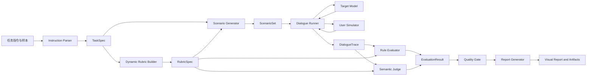

<div align="center">

# Agent Partner

### 复杂指令驱动的多轮对话自动评测平台

将业务任务指令自动编译为动态评分标准、用户测试场景、多轮对话轨迹与可追溯评测报告。

面向履约外呼、智能客服、运营助手等需要验证模型**任务完成、流程遵循、FAQ 准确性与安全边界**的场景。

[](https://www.python.org/)
[](https://fastapi.tiangolo.com/)
[](https://react.dev/)
[](https://www.typescriptlang.org/)
[](https://vite.dev/)
[](#测试与验证)

[在线体验](https://agentpartner.top) ·
[核心能力](#核心能力) ·
[快速开始](#快速开始) ·
[系统架构](#系统架构) ·
[API](#主要-api) ·
[项目文档](#项目文档)

</div>

> [!IMPORTANT]
> 在线地址是共享的公开测试环境，评测历史和产物可能被其他测试者看到。请勿上传生产数据、个人敏感信息、真实访问令牌或内部机密指令。
>
> 当 `APP_AUTH_REQUIRED=false` 时，部署处于 `intentionally anonymous` 模式：任何获得访问链接的人都可能调用共享业务 API 并查看环境中的历史产物。

## 项目简介

复杂业务对话不是“问一句、答一句”的单轮测试。

一个可以上线的外呼数字人或客服模型，需要在连续对话中同时做到：

- 完成身份确认、通知、询问、解释、挽留等业务步骤；
- 准确回答任务指令中给出的 FAQ 和知识点；
- 面对忙碌、拒绝、追问、打断、错号和越界诉求时正确处理；
- 不编造政策、奖励、价格、时效或未授权承诺；
- 保持角色、上下文、语气和用户画像一致；
- 在用户明确结束时自然收尾，而不是无限追问或过早终止。

传统人工抽检成本高、覆盖不稳定；单轮 LLM Judge 又难以解释“哪里错了”。Agent Partner 将原始任务指令转化为一条可执行、可观察、可回归的评测链路：

```text
任务指令 / 样本数据
  -> 指令结构化解析
  -> 动态 Rubric 生成
  -> 用户测试场景生成
  -> 多轮对话执行
  -> 规则评测 + 语义 Judge
  -> 质量门禁与自动修复
  -> 可视化报告、证据链与优化建议
```

最终结果不仅包含一个分数，还能回答：

- 哪个任务步骤未完成？
- 哪条约束被违反？
- 问题发生在哪个场景、哪一轮对话？
- Judge 使用了什么证据？
- 本次评测本身是否具有足够覆盖度和可信度？

## 核心能力

| 能力 | 说明 |
| --- | --- |
| 复杂指令解析 | 从自然语言指令中抽取角色、目标、开场白、流程步骤、FAQ、约束、异常分支和禁止行为 |
| 动态 Rubric | 根据当前任务生成评分项、权重、检查类型和关键失败项，不依赖单一固定模板 |
| 用户模拟器 | 基于用户画像、难度、覆盖目标和风险标签生成自然用户反应，并防止角色反转、复述和跨业务串场 |
| 多轮对话 Runner | 被测模型与用户模拟器交替发言，最多支持 8 个完整交互轮次，并持久化完整对话轨迹 |
| 明确终止协议 | 用户明确确认、拒绝、挂断或无法继续后，目标模型完成一次自然收尾；控制标记不会进入报告 |
| 混合自动评分 | 可程序化硬规则与语义 Judge 结合，兼顾确定性、语义理解和异常分支判断 |
| 可解释证据链 | 将任务指令依据、预期行为、实际对话轮次、评分结论和扣分原因关联起来 |
| 质量门禁 | 检查场景覆盖、Rubric 适配、Judge 漏评、证据追溯、报告完整性与阶段耗时 |
| 双评测模式 | 支持一键端到端快速评测，以及可查看、编辑、重跑中间产物的分阶段评测 |
| 历史与对比 | 保存完整 run artifacts，支持历史详情、场景切换、失败定位和评测对比 |
| 多模型路由 | 被测目标模型由前端配置；解析、场景、用户模拟、Judge 和报告模型由后端分别配置 |
| 异步执行 | 生产环境通过 Redis 队列和独立 worker 执行耗时评测，前端轮询任务状态 |

## 两种评测方式

### 端到端快速评测

适合模型快速验收、日常回归和演示。

用户提供任务指令、被测模型和场景数量后，平台自动完成：

1. 解析任务；
2. 生成 Rubric；
3. 生成测试场景；
4. 执行多轮对话；
5. 自动评分；
6. 生成质量摘要和报告。

### 分阶段评测

适合评测专家、Prompt 工程师和算法同学调试链路。

| 阶段 | 可观察产物 |
| --- | --- |
| 模型配置 | 被测模型与后端评测模型路由 |
| 样本导入 | 表格数据、内置样本和输入摘要 |
| 指令解析 | `TaskSpec`：角色、目标、步骤、FAQ、约束和边界 |
| 评分标准 | `RubricSpec`：维度、标准、权重、检查类型和关键项 |
| 场景生成 | `ScenarioSet`：用户画像、初始意图、覆盖目标和风险标签 |
| 执行评测 | `DialogueTrace` 与逐场景 `EvaluationResult` |
| 报告分析 | 总分、维度分、失败证据、质量门禁和优化建议 |

用户确认或编辑过的 `TaskSpec`、`RubricSpec` 和 `ScenarioSet` 会直接进入最终评测，不会在提交运行时被重新生成。

## 系统架构



### 模型职责隔离

| 角色 | 默认职责 |
| --- | --- |
| Target Model | 被测对话模型，执行实际业务任务 |
| Instruction Parser | 将原始任务转为结构化 `TaskSpec` |
| Rubric Generator | 生成适配当前任务的动态评分标准 |
| Scenario Generator | 生成覆盖不同分支和风险的测试场景 |
| User Simulator | 扮演被外呼用户，根据历史动态回应 |
| Semantic Judge | 结合 Rubric 和对话证据判断语义表现 |
| Report Generator | 汇总结构化结果，形成报告与优化建议 |

每个角色都保留独立的模型调用诊断，包括 provider、model name、prompt ID、调用次数和重试次数，便于定位链路异常。

## 多轮对话与结束机制

平台的 `DialogueRunner` 使用统一状态机服务端到端和分阶段评测：

- 默认最多 8 个完整用户交互轮次；
- 对应最多 17 条消息：1 条 assistant 开场 + 8 组用户/assistant 回复；
- 用户模拟器在真实终局时发出内部结束信号；
- 目标模型收到终局信号后生成最后一条自然收尾；
- 用户仍在追问或补充信息时，不会因为目标模型过早输出结束标记而提前停止；
- 达到最大轮数仍未结束时，以 `max_turns` 安全终止；
- 内部控制标记会在持久化前移除，不会泄露给 Judge、报告或前端。

常见终止原因：

| 原因 | 含义 |
| --- | --- |
| `task_completed` | 用户明确结束，目标模型正确完成收尾 |
| `user_ended` | 用户已经结束，但目标模型未正确确认或对话过早终止 |
| `max_turns` | 用户仍在继续互动，达到 8 轮安全上限 |
| `runtime_error` | Provider 或执行阶段出现运行异常 |

## 可解释评测

平台采用三层证据链：

```text
任务指令依据
    -> 预期行为 / Rubric
        -> 实际对话轮次
            -> verdict、得分与判定解释
```

报告可以展示：

- 总分、通过率和关键失败数量；
- 任务完成度、流程遵循度、约束遵循度、FAQ、安全边界和自然度；
- 场景覆盖矩阵与逐场景得分；
- `pass`、`partial`、`fail`、`needs_review` 判定；
- 失败项对应的指令来源和对话原文；
- 场景覆盖、证据追溯率和 Judge 完整性；
- 自动修复动作、阶段耗时和模型调用诊断。

## 评测产物

每次运行会在 `runs/{run_id}/` 下保存可复查产物：

```text
runs/run_xxxxxxxx/
├── run_config.json
├── input_data.json
├── task_spec.json
├── rubric_spec.json
├── scenarios.json
├── traces.jsonl
├── evaluation_results.json
├── quality_summary.json
├── stage_diagnostics.json
├── stage_timings.json
└── report.md
```

这些产物让评测结果可以复现、审计、对比，也便于后续接入数据库或对象存储。

## 技术栈

| 层级 | 技术 |
| --- | --- |
| 前端 | React 18、TypeScript、Vite、Ant Design、TanStack Query、ECharts |
| API | FastAPI、Pydantic、Uvicorn |
| 评测引擎 | Python、规则评估、LLM Semantic Judge、结构化 artifacts |
| 模型接入 | OpenAI-compatible Chat Completions、OpenRouter、自建模型网关、Mock Provider |
| 异步任务 | Redis 队列、双 worker、任务状态轮询 |
| 部署 | Ubuntu、systemd、Nginx、Let's Encrypt、UFW |
| 测试 | pytest、FastAPI TestClient、TypeScript/Vite production build |

## 快速开始

### 环境要求

- Python 3.9+
- Node.js 18+
- npm

### 1. 获取代码

```bash
git clone https://github.com/ZIRENLI-001/agent_partner.git
cd agent_partner
git checkout feature/invited-public-beta
```

### 2. 安装依赖

```bash
make install
```

Windows PowerShell 没有 `make` 时可分别运行：

```powershell
python -m pip install -e ".[dev]"
Set-Location frontend
npm ci
Set-Location ..
```

### 3. 启动本地服务

```bash
make dev
```

等价命令：

```bash
python3 -m uvicorn backend.eval_agent.api.main:app --host 127.0.0.1 --port 8070
```

Windows 环境也可以使用 `python -m uvicorn backend.eval_agent.api.main:app --host 127.0.0.1 --port 8070`。

访问：

```text
http://127.0.0.1:8070/
```

未配置真实模型密钥时，平台会使用 Mock Provider，适合离线体验完整链路。

### 4. 构建前端

```bash
make build
```

### 5. 运行测试

```bash
make test
```

或分别运行：

```bash
python -m pytest -q
cd frontend && npm run build
```

### 6. 执行冒烟检查

```bash
make smoke
```

## 模型配置

复制示例配置：

```bash
cp .env.example .env
```

Windows PowerShell：

```powershell
Copy-Item .env.example .env
```

后端评测链路模型由环境变量统一管理：

```dotenv
EVAL_CHAIN_PROVIDER=openrouter
EVAL_CHAIN_API_BASE=https://openrouter.ai/api/v1
EVAL_CHAIN_API_KEY=<server-side-key>

EVAL_INSTRUCTION_PARSER_MODEL=your-parser-model
EVAL_RUBRIC_GENERATOR_MODEL=your-rubric-model
EVAL_SCENARIO_GENERATOR_MODEL=your-scenario-model
EVAL_USER_SIMULATOR_MODEL=your-user-simulator-model
EVAL_SEMANTIC_JUDGE_MODEL=your-judge-model
EVAL_REPORT_GENERATOR_MODEL=your-report-model
```

> [!WARNING]
> `EVAL_CHAIN_API_KEY` 只能保存在服务端环境变量或受控密钥系统中，不要提交到 Git、写入 README、传给浏览器或保存在 run artifacts 中。

前端只需要配置被测 Target Model。评测链路的 Parser、Rubric、Scenario、User Simulator、Judge 和 Report 模型由后端控制，避免评测者篡改裁判链路。

常用配置项：

| 变量 | 作用 |
| --- | --- |
| `APP_ENV` | `development` 或 `production` |
| `APP_AUTH_REQUIRED` | 是否启用共享 Bearer Token 访问门禁 |
| `APP_ACCESS_TOKEN` | 邀请测试环境的共享访问令牌 |
| `ALLOWED_MODEL_API_BASES` | 允许访问的模型 API Base 精确白名单 |
| `REQUEST_TIMEOUT_SECONDS` | 单次模型请求超时 |
| `REQUEST_RETRY_COUNT` | 模型请求重试次数 |
| `EVAL_SCENARIO_CONCURRENCY` | 场景并发执行数 |
| `EVAL_SCENARIO_BATCH_SIZE` | 场景批次大小 |
| `EVAL_MODEL_CACHE_TTL_SECONDS` | 后端评测模型调用缓存时间 |
| `EVAL_RUN_STATUS_TTL_SECONDS` | Redis 或内存任务状态保留时间 |
| `EVAL_ARTIFACT_ROOT` | 评测 artifacts 保存目录 |

完整列表见 [.env.example](.env.example)。

## 主要 API

| 方法 | 路径 | 说明 |
| --- | --- | --- |
| `GET` | `/api/health` | 综合健康检查 |
| `GET` | `/api/health/live` | API 存活检查 |
| `GET` | `/api/health/ready` | Redis、artifact 和依赖就绪检查 |
| `GET` | `/api/context` | 当前用户、工作空间和项目上下文 |
| `POST` | `/api/stages/parse` | 生成结构化任务规格 |
| `POST` | `/api/stages/rubric` | 生成动态 Rubric |
| `POST` | `/api/stages/scenarios` | 生成用户模拟场景 |
| `POST` | `/api/runs/async` | 提交异步评测任务 |
| `GET` | `/api/runs/{run_id}/status` | 查询运行状态 |
| `GET` | `/api/runs/{run_id}` | 获取完整评测结果 |
| `GET` | `/api/runs/history` | 获取历史评测 |
| `GET` | `/api/runs/comparison` | 获取评测对比数据 |
| `POST` | `/api/import/evaluation-rows` | 导入表格评测数据 |
| `GET` | `/api/calibration/summary` | 获取校准数据摘要 |

生产环境默认关闭同步 `POST /api/runs`，耗时任务统一通过异步队列执行。

## 项目结构

```text
agent_partner/
├── backend/
│   ├── eval_agent/
│   │   ├── api/              # FastAPI 路由和中间件
│   │   ├── core/             # 配置与安全边界
│   │   ├── providers/        # OpenAI-compatible Provider
│   │   └── services/         # 阶段、run、队列和状态编排
│   └── evaluation_engine/    # 纯评测引擎与领域模型
├── frontend/                 # React + TypeScript 可视化应用
├── background/               # 命题背景与任务指令样例
├── data/calibration/         # 校准样本数据
├── deploy/                   # Nginx、Redis、systemd 和发布脚本
├── docs/                     # 产品、技术、架构和实施文档
├── scripts/                  # 安全检查与 artifacts 清理
├── tests/                    # 后端与链路回归测试
├── .env.example
├── Makefile
└── README.md
```

## 测试与验证

当前验证范围包括：

- 指令解析、Rubric、场景生成和多轮对话单元测试；
- 用户模拟角色一致性、跨业务串场和错误输出防护；
- 规则评分、语义 Judge、报告完整性和证据追溯；
- 分阶段 confirmed artifacts 一致性；
- 多模型路由、Prompt ID 和模型调用诊断；
- Redis 队列、状态存储、配额、超时和 worker 恢复；
- 文件导入、路径穿越、上传大小和模型出站白名单；
- Nginx、systemd、Redis 与发布资产检查；
- React/TypeScript 生产构建。

最近一次本地完整验证：

```text
pytest: 310 passed, 1 skipped
frontend: 3632 modules transformed, production build succeeded
```

服务器 clean release 验证：

```text
pytest: 311 passed
npm audit: 0 vulnerabilities
Vite production build: succeeded
```

## 生产部署

仓库提供 Ubuntu 24.04 发布资产：

```bash
sudo ./deploy/bootstrap-ubuntu.sh
sudo ./deploy/install-release.sh /srv/agent_partner/releases/<release>
```

部署拓扑：

```text
Internet
  -> Nginx :443 / Let's Encrypt
      -> FastAPI 127.0.0.1:8070
          -> Redis 127.0.0.1
              -> evaluation worker 1
              -> evaluation worker 2
```

生产边界包括：

- FastAPI 和 Redis 仅监听本机；
- Nginx 是唯一公开入口；
- HTTPS 与安全响应头；
- Trusted Host 与代理来源校验；
- JSON、上传、表格、压缩包和模型响应大小限制；
- 模型 API Base 精确白名单、HTTPS 限制和禁止重定向；
- Redis 队列容量、IP 小时配额和任务租约；
- 低权限 systemd 服务和 artifacts 定时清理；
- release 级测试、原子 symlink 切换和失败回滚。

当前共享 Token 适合邀请测试，不等同于完整多租户认证。面向不受信任用户正式开放前，应补充用户级身份、授权、持久数据库和资源所有权隔离。

## 项目文档

| 文档 | 内容 |
| --- | --- |
| [项目完整介绍](docs/project_introduction_for_judges.md) | 面向评委与业务方的能力、价值和演示说明 |
| [评测系统方案](docs/multi_turn_dialogue_eval_agent_proposal.md) | 赛题理解、用户模拟、评分和报告方案 |
| [技术方案](docs/multi_turn_dialogue_eval_agent_technical_design.md) | 核心领域模型、执行链路和模块设计 |
| [生产平台技术选型](docs/architecture/production-platform-tech-selection.md) | React、FastAPI、存储、异步任务和部署架构 |
| [验证记录](docs/verification.md) | 历史功能验证与 smoke test 记录 |
| [部署历史](docs/operations/2026-06-07-invited-public-beta-deployment.md) | 邀请测试环境的安全控制和部署结果 |
| [分阶段产物一致性设计](docs/superpowers/specs/2026-06-08-staged-evaluation-artifact-consistency-design.md) | 分阶段确认产物如何进入最终评测 |
| [对话终止协议设计](docs/superpowers/specs/2026-06-08-dialogue-termination-protocol-design.md) | 8 轮预算、用户终局和目标模型收尾协议 |

## 适用场景

- 履约外呼数字人上线前验收；
- 智能客服复杂任务指令回归；
- Prompt 或模型版本横向对比；
- FAQ、流程和安全边界覆盖测试；
- 线上失败案例复现与证据定位；
- 评测 Rubric 和用户模拟器校准。

## 当前边界

项目目前聚焦“复杂指令下的多轮对话遵循评测”，不是：

- 通用模型训练平台；
- 自动修改被测模型的优化系统；
- 面向海量用户的完整 SaaS 多租户产品；
- 可替代人工业务验收的唯一决策依据。

建议将自动评测与人工抽检、业务指标和真实线上反馈结合使用。

---

<div align="center">

**让复杂对话评测从“凭感觉听录音”，变成可执行、可量化、可追溯的工程流程。**

[在线体验](https://agentpartner.top) ·
[查看代码](https://github.com/ZIRENLI-001/agent_partner) ·
[创建 Issue](https://github.com/ZIRENLI-001/agent_partner/issues)

</div>
